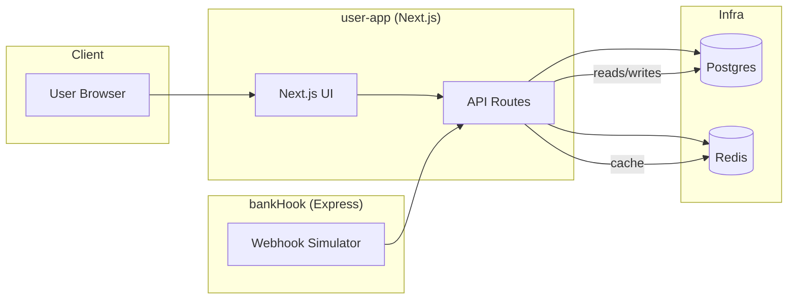

---

### `ARCHITECTURE.md`
```md
# 🏗 DriftPro — Architecture


---

## Overview
DriftPro is built as a monorepo with a Next.js front-end/back-end application and a separate Express microservice (`bankHook`) that simulates bank webhooks. The system uses PostgreSQL as the source of truth and Redis (Upstash / ioredis) for caching, session storage, and rate-limiting. Prisma is used as the ORM and schema layer.

---

## High-level Components

- **user-app (Next.js)**  
  - UI, API routes, auth (NextAuth), wallet endpoints, webhooks receiver (main).  
- **bankHook (Express)**  
  - Simulated bank service that calls back to `user-app` webhook endpoints with transaction status.  
- **PostgreSQL (packages/db)**  
  - Wallet table, transactions ledger, users table — all operations performed in transactions.  
- **Redis (Upstash/ioredis)**  
  - Cache balances, sessions, rate limit counters.  
- **Prisma**  
  - DB client & migrations.  
- **CI/CD**  
  - GitHub Actions, Docker build and deploy to Vercel (frontend) and Render (bankHook).

---

## Mermaid: System Architecture (renderable on GitHub)



sequenceDiagram
  participant U as User
  participant F as Frontend
  participant API as user-app API
  participant BH as bankHook (Express)
  participant DB as Postgres
  participant RED as Redis

  U->>F: Click "Add Money" (amount)
  F->>API: POST /api/create-transaction {amount}
  API->>DB: INSERT pending_transaction (token) [transaction]
  API->>F: 200 {token, redirect}
  F->>BH: POST /bank/simulate {token}
  BH->>API: POST /api/webhook {token, status: success}
  API->>DB: BEGIN
  API->>DB: UPDATE wallet balance, INSERT ledger
  API->>DB: COMMIT
  API->>RED: Invalidate/Set cache for wallet
  API->>F: Notify success
