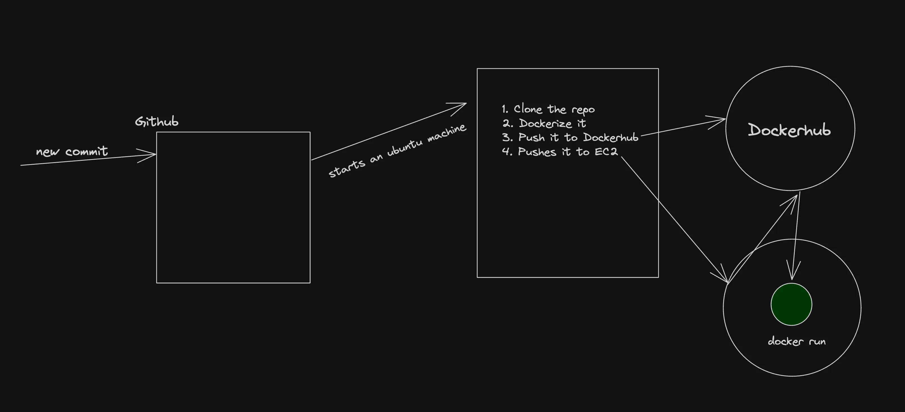

## Continuous Integration
Continuous Integration (CI) is a development practice where developers frequently integrate their code changes into a shared repository, preferably several times a day. Each integration is automatically verified by 
Building the project and Running automated tests. 
- This process allows teams to detect problems early, improve software quality, and reduce the time it takes to validate and release new software updates.


## Continuous Deployment
As the name suggests, deploying your code continuously to various environments (dev/stage/prod)




```yml
name: what happens on PR 

on:
  pull_request:
    branches:
      - master
      - main

jobs:
  build:
    runs-on: ubuntu-latest
    steps:
      - uses: actions/checkout@v3
      - name: Use Node.js
        uses: actions/setup-node@v3
        with:
          node-version: '20'
      
      - name: Install Dependencies
        run: npm install

      - name : Prisma setup
        run : npm run db:generate 
        # update package.json accordingly as "db:generate" : "db:generate" : "cd packages/db && npx prisma generate && cd ../.." ,

        
      - name: Run Build
        run: npm run build
